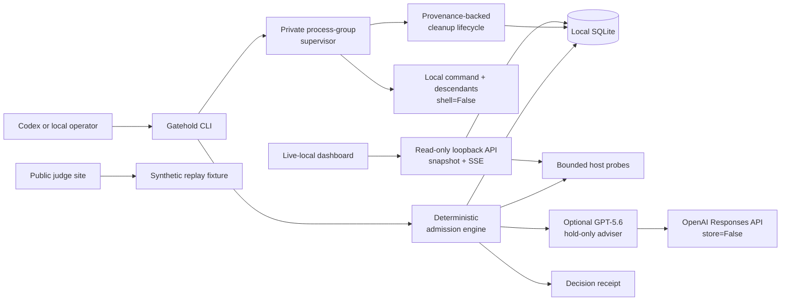
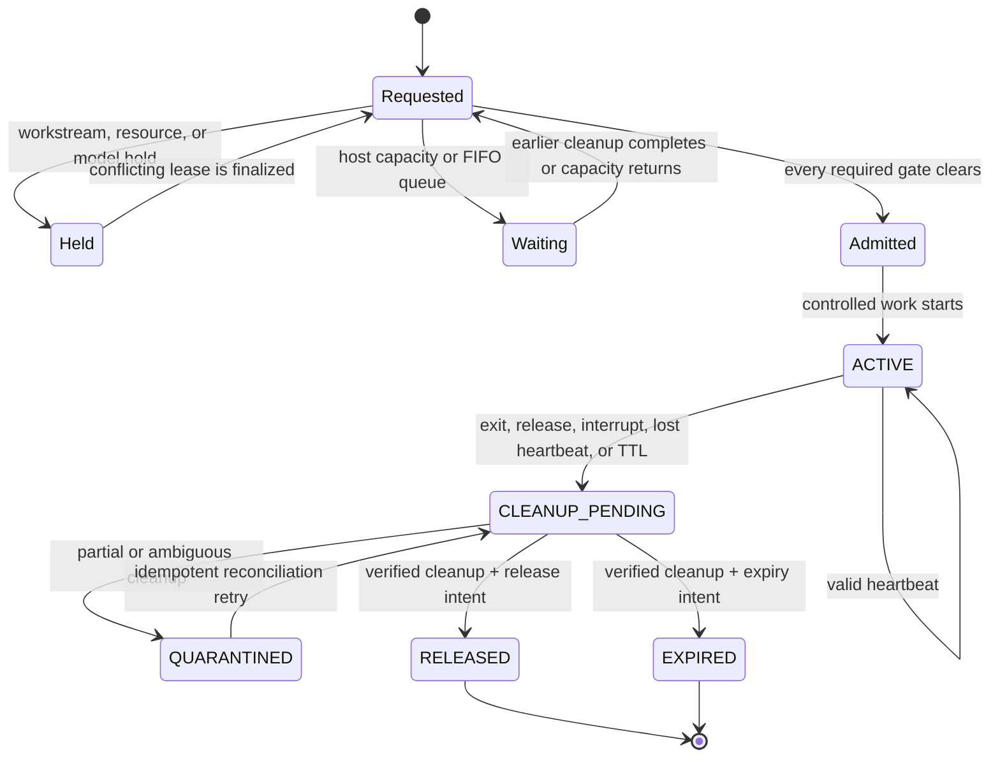

# Gatehold Architecture

## Purpose

Gatehold is a local admission-control plane for cooperative AI coding agents.
It serializes conflicting work, limits expensive concurrent work, and assigns
exclusive runtime resources before a controlled task starts.

The architecture is deliberately asymmetric:

- deterministic local code is the only component that can grant clearance;
- GPT-5.6 can add a semantic-overlap hold, but cannot grant or restore
  clearance;
- Codex follows the claim, heartbeat, governed-run, and release workflow;
- the public web experience replays synthetic data and cannot inspect a
  visitor's workstation.

## System context



The CLI is the only mutation and command-execution surface. It invokes the local
service directly. HTTP is strictly read-only: health, sanitized snapshot, and
sanitized server-sent events.

## Components

### CLI

The `gatehold` command exposes initialization, status, claim, heartbeat,
release, governed run, daemon, and bounded demo operations. It:

- validates arguments before invoking the local service;
- starts commands only after clearance;
- uses argument arrays with `shell=False`;
- heartbeats active work;
- supervises governed commands in a private process group;
- requests cleanup after normal completion, interruption, heartbeat loss, or
  recovery;
- releases leases only after owned cleanup is verified;
- returns a non-zero result when clearance is not granted.

The exact command reference is available through:

```bash
uv run gatehold --help
uv run gatehold <command> --help
```

### Read-only loopback API

The FastAPI service binds to `127.0.0.1` and returns bounded Pydantic response
models:

- `GET /healthz`;
- `GET /v1/snapshot?recent=0..100`;
- `GET /v1/events?after=N` (server-sent events with `Last-Event-ID` resume).

It has no HTTP claim, heartbeat, release, or command endpoint. The service:

- validates `Host` as loopback (`127.0.0.1` or `localhost`);
- accepts browser reads only from an exact origin explicitly passed with
  `--dashboard-origin` or listed in `GATEHOLD_DASHBOARD_ORIGINS`; localhost is
  not implicitly trusted;
- echoes an exact allowed CORS origin with no wildcard and no credentials;
- keeps `/healthz` unauthenticated but loopback-Host-only and limited to
  status/version;
- requires a bearer token from the mode-`0600` local token file for
  origin-less CLI/curl reads under `/v1/*`;
- never puts the token in a URL, query, browser storage, fixture, or Sites
  configuration;
- disables generated OpenAPI and documentation routes;
- treats descriptions, scopes, paths, process data, and model output as
  untrusted;
- returns explicit decision reasons and receipt metadata.

Loopback binding reduces remote exposure. It is not authentication against
other processes running as the same local user.

### Deterministic admission engine

The engine is authoritative. Within a SQLite transaction it:

1. validates and normalizes a request;
2. expires stale leases;
3. checks protected workstream conflicts;
4. checks exclusive runtime-resource conflicts;
5. evaluates host-capacity policy for the requested task class;
6. preserves FIFO ordering where capacity waiting applies;
7. applies any valid GPT-5.6 hold-only advisory;
8. issues a TTL-bound lease and opaque heartbeat token only if every required
   gate clears.

No model output can skip steps 3 through 6.

### Local persistence

SQLite stores only the bounded operational state required to recover leases and
explain decisions:

- request and lease identifiers;
- owner identifier;
- normalized workstream and bounded claim metadata;
- task class and requested runtime resources;
- queue position and timestamps;
- TTL, heartbeat state, requested terminal state, and cleanup state;
- bounded managed-runtime provenance: PID, process-group/session identity,
  process create time, host boot time, and secret-derived digests;
- dedicated browser-profile device/inode identity and marker digest;
- exact simulator UDID, ownership state, boot-intent time, ownership-confirmed
  time, and cleanup time;
- bounded decision reason codes and estimate fields.

Gatehold does not use SQLite as a prompt, source-code, diff, conversation, or
command-history store.

### Host probes

Host probes provide bounded local CPU and memory-pressure signals. They inform
deterministic capacity policy; they do not kill, suspend, renice, or rewrite
unrelated processes.

Capacity receipts describe estimates as estimates. They are not benchmark
results or proof that Gatehold reduced a specific energy or time cost.

### Owned managed-runtime cleanup

`gatehold run` adds an execution lifecycle after admission. The CLI creates a
private process-group/session supervisor and records its identity before
activating the requested command. The child and any descendants, including a
dev server that outlives its direct parent, inherit a secret run marker. The
marker itself is not persisted; SQLite stores its digest with the captured
process and boot identities.

Cleanup is deliberately fail-closed:

1. explicit release or expiry records the intended terminal state, but the
   lease remains `ACTIVE`;
2. Gatehold enters `CLEANUP_PENDING` and re-checks the persisted identity;
3. only a process group with matching provenance may receive bounded
   `TERM`-then-`KILL` cleanup;
4. a simulator is eligible for shutdown only when its exact configured UDID
   has complete Gatehold-owned boot provenance;
5. only after the process group is gone can Gatehold remove an exactly marked
   dedicated browser-profile directory and verify an allocated port is
   bind-free;
6. positive completion finalizes allocations, workstream authority, and the
   requested `RELEASED` or `EXPIRED` state.

If identity is missing, reused, or ambiguous, Gatehold sends no signal. A
partial result becomes `QUARANTINED`: the workstream conflict and allocations
remain authoritative while daemon reconciliation retries the idempotent
cleanup path. The cleanup daemon drains pending work on startup and subsequent
reconciliation cycles.

This is an owned-resource contract, not a workstation sweep. Gatehold never
searches by process name or port and never cleans a browser profile it did not
create and mark.

### Exact-UDID simulator ownership

The simulator adapter is a separate fail-closed lifecycle on macOS:

1. Gatehold inspects the configured, allocated UDID before acting.
2. If that exact simulator is already booted, Gatehold records it as
   `external`. It does not boot, claim, or later shut it down.
3. If it is not booted, Gatehold persists `boot_intent` before issuing the boot
   command.
4. Only a successful boot followed by a positive `is_booted` confirmation for
   the same UDID may transition the record to `owned`.
5. Cleanup may shut down only that exact `owned` UDID. It confirms the device
   is no longer booted before marking the simulator lifecycle `cleaned`.

A failed or unconfirmed boot remains `boot_intent`. That ambiguity is
`QUARANTINED`: the simulator allocation and workstream authority stay active,
and cleanup issues zero guessed shutdown commands. Legacy ownership records are
migrated into the same fail-closed state instead of being trusted retroactively.

### GPT-5.6 hold-only adviser

The optional adviser receives bounded claim metadata, not source code or diffs.
It can identify semantically similar work described with different words. Its
schema has no clearance-granting operation.

A valid model result may:

- identify a possible overlap between known claim IDs;
- cite the bounded reason;
- request an additional hold.

It may not:

- admit a task;
- clear a deterministic conflict;
- change queue order;
- allocate a resource;
- execute a command;
- mutate persistence directly.

Failure, refusal, timeout, invalid schema, or missing credentials produces a
transparent local-policy fallback. The deterministic result remains intact.

### Dashboard

The same product language supports two distinct modes:

- **Replay** embeds a bounded synthetic scenario mirrored by the committed
  fixture under `fixtures/demo/`. It works publicly and requires no access to
  the viewer's computer.
- **Live local** reads the loopback daemon on the same workstation. It shows
  only local Gatehold state and current bounded host signals.

The mode label is part of the trust boundary. A replay must never be presented
as live telemetry. Every dashboard origin, including local development, works
only when the operator explicitly allows that exact origin at daemon startup.
Local loopback origins may use HTTP; non-loopback origins must use HTTPS. The
browser still reads the daemon on the same workstation.

## Decision and lease states



`Held` and `Waiting` are observable decisions, not failures to enforce policy.
An agent must not edit or start controlled heavy work while in either state.
`CleanupPending` and `Quarantined` retain the active conflict and allocations;
they are not optimistic release states. These are lifecycle contract terms: in
the current sanitized snapshot the lease deliberately remains `ACTIVE`, while
bounded `runtime.cleanup` events distinguish a cleaned or partial attempt.

## Authority matrix

| Decision | Deterministic engine | GPT-5.6 | Codex/client |
| --- | --- | --- | --- |
| Detect exact workstream conflict | Authoritative | May explain | Supplies bounded claim |
| Detect semantic overlap | Preserves baseline; honors valid additional hold | May raise hold | Cannot dismiss hold |
| Evaluate host capacity | Authoritative | No authority | Selects task class |
| Allocate exclusive resource | Authoritative | No authority | Requests named resource |
| Grant clearance | Sole authority | Prohibited | Must wait |
| Execute a command | No HTTP execution | Prohibited | CLI only, after clearance |
| Heartbeat/release | Validates token and lease | No authority | Responsible for lifecycle |
| Verify managed-process provenance | Sole authority | No authority | Cannot assert ownership |
| Signal an owned process group | Only after identity match | Prohibited | Requests through governed lifecycle |
| Boot/shut down a configured simulator | Only after exact-UDID ownership protocol | Prohibited | Requests the simulator lane |
| Finalize workstream/resources | Only after verified cleanup | Prohibited | Cannot force finalization |

## Security boundaries

1. **Browser ↔ public replay** — synthetic, committed data only.
2. **Browser/CLI ↔ read-only loopback API** — sanitized reads with Host,
   Origin/CORS, or bearer checks.
3. **CLI/admission engine ↔ SQLite** — direct transactional lease authority.
4. **Admission engine ↔ host probes** — read-only, bounded system signals.
5. **Admission engine ↔ OpenAI** — optional, bounded metadata and strict output
   schema with `store=False`.
6. **CLI ↔ supervisor/child process** — argument-vector execution with
   `shell=False`, private process-group identity, and activation handshake.
7. **Cleanup lifecycle ↔ owned runtime** — bounded provenance verification
   before any signal, exact-marker browser-profile removal, and bind-free port
   confirmation.
8. **Simulator lifecycle ↔ `simctl`** — exact configured UDID, durable boot
   intent, positive ownership confirmation, and no action on pre-booted or
   ambiguous devices.

See [Threat Model](THREAT-MODEL.md) for abuse cases and residual risk.

## Platform posture

macOS is the primary supported platform. Linux support is best-effort for the
Python daemon, CLI, SQLite state, and generic resource leases. Allocated ports
are selected with a cooperative loopback availability probe and are not
finalized until a later probe confirms the port is bind-free.
Browser-profile directories use mode `0700`; removal requires the exact
Gatehold marker, persisted device/inode identity, and marker digest. Gatehold
allocates the profile path but does not launch a browser itself. Physical
simulator lifecycle uses `xcrun simctl` and is supported only on macOS. Linux
remains best-effort for the daemon, CLI, and generic resource leases; it does
not provide the Apple Simulator adapter.

## Extension rules

Any change to auth, persistence, network binding, host probes, model prompts,
command execution, or lease authority must preserve
[Product Contract](PRODUCT-CONTRACT.md), update
[Privacy](PRIVACY.md) and [Threat Model](THREAT-MODEL.md), and add focused
tests before handoff.
